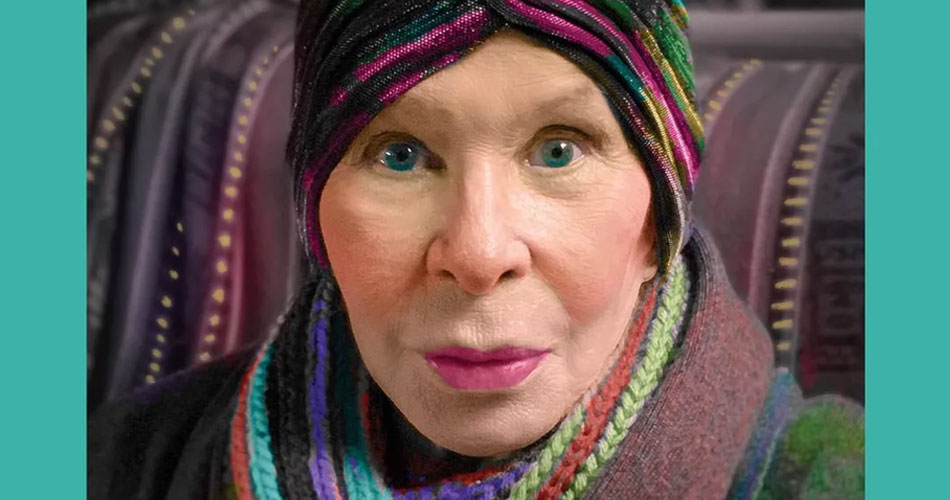
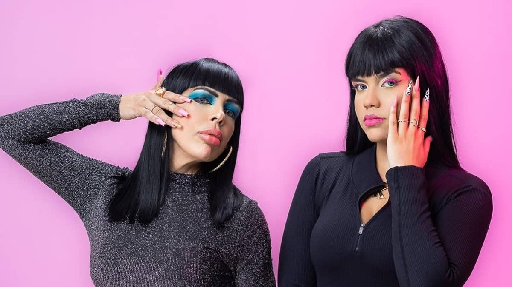

<!DOCTYPE html>
<html lang="en">
<head>
    <meta charset="UTF-8">
    <meta http-equiv="X-UA-Compatible" content="IE=edge">
    <meta name="viewport" content="width=device-width, initial-scale=1.0">
    <title>Document</title>
</head>

<body>
  <h1>MORRE AOS 75 ANOS CANTORA RITA LEE</h1>  
  
  

    Uma das maiores cantoras e compositoras da história do Brasil, ela morreu nesta segunda (8). Rita foi diagnosticada com câncer de pulmão em 2021 e vinha fazendo tratamentos contra doença.

  
  
  <body>
<h1><h1
>
</body> 

 Rita ajudou a incorporar a revolução do rock à explosão criativa do tropicalismo, formou a banda brasileira de rock mais cultuada no mundo, os Mutantes, e criou canções na carreira solo com enorme apelo popular sem perder a liberdade e a irreverência.
Sempre moderna, Rita foi referência de criatividade e independência feminina durante os quase 60 anos de carreira. O título de “rainha do rock brasileiro” veio quase naturalmente, mas ela achava “cafona” - preferia “padroeira da liberdade”.
  Rita Lee Jones nasceu em São Paulo, em 31 de dezembro de 1947. O pai, Charles Jones, era dentista e filho de imigrantes dos EUA. A mãe, a italiana Romilda Padula, era pianista, e incentivou a filha a estudar o instrumento e a cantar com as irmãs. 
Aos 16 anos, Rita integrou um trio vocal feminino, as Teenage Singers, e fez apresentações amadoras em festas de escolas. O cantor e produtor Tony Campello descobriu as cantoras e as chamou para participar de gravações como backing vocals.

<h1> Os Mutantes <h1>

 Em 1964 ela entrou em um grupo de rock chamado Six Sided Rockers que, depois de algumas mudanças de formações e de nomes, deu origem aos Mutantes em 1966. O grupo foi formado inicialmente por Rita Lee, Arnaldo Baptista e Sérgio Dias. 
 Eles foram fundamentais no tropicalismo, ao unir a psicodelia aos ritmos locais, e se tornaram o grupo brasileiro com maior reconhecimento entre músicos de rock do mundo, idolatrados por Kurt Cobain, David Byrne, Jack White, Beck e outros. 

O trio acompanhou Gilberto Gil em “Domingo no parque” no 3º Festival de Música Popular Brasileira da Record, em 1967, e Caetano Veloso em “É proibido proibir” no 3º Festival Internacional da Canção, da Globo em 1968, dois marcos da tropicália.

<h1>MÃE E FILHA DO TIK TOK SAO CANCELADAS POR FAZER RACISMO EM SEUS VIDEOS <h1>

 As duas somam 17 milhões de seguidores nas redes sociais e postam vídeos de assistencialismo, testes de maquiagem e pegadinhas.

 

</body> 

 As influenciadoras Kérollen Cunha e Nancy Gonçalves passaram a ser investigadas pela Delegacia de Crimes Raciais e Delitos de Intolerância (Decradi) por vídeos em que aparecem entregando um macaco de pelúcia, uma banana e dinheiro para crianças negras abordadas na rua.
    Nancy e Kérollen se apresentam como “mãe e filha divertindo você”, mas em diversos vídeos afirmam ser meias-irmãs de pais diferentes — em um deles, Nancy conta ter pegado a caçula para criar depois que a mãe das duas avisou que daria Kérollen para adoção.
    Em outra publicação, Nancy afirma ter sido garota de programa “por necessidade” e “para cuidar de Kérollen”. 

<h1> ‘Racismo recreativo’ <h1>

 No inquérito que será aberto na Decradi, os investigadores vão apurar se Kérollen e Nancy praticaram crime de racismo ou injúria racial e se também infringiram o Estatuto da Criança e do Adolescente.
    O caso veio à tona após a advogada Fayda Belo, especialista em direito antidiscriminatório, denunciar os vídeos — já apagados dos canais. A advogada destacou que as cenas apresentam o chamado “racismo recreativo”, que ocorre quando alguém usa de “discriminação contra pessoas negras com intuito de diversão”.
    “O racismo recreativo incita a discriminação e tira de nós, pessoas negras, o status de pessoa, nos animaliza e nos desumaniza. Seguirei com a denúncia dentro da lei e me coloco à disposição para esclarecimentos”, finaliza.
    O Ministério Público do Estado do Rio de Janeiro (MPRJ) recebeu, até esta quarta-feira (31), 690 comunicações com denúncias contra os vídeos
    Em nota divulgada por sua assessoria jurídica, a dupla disse que "não havia intenção de fazer qualquer referência a temáticas raciais ou a discriminações de minorias" no vídeo
    "Sendo assim, gostariam de se dirigir às pessoas que se sentiram diretamente atingidas, para dizer que não tivemos intenção de as ofender individualmente, nem como gênero, etnia, classe ou categoria a que elas pertençam", diz um trecho do texto.
    Não há informações sobre o local exato dos registros, mas Kérollen e Nancy usualmente gravam em Niterói e em São Gonçalo, na Região Metropolitana do Rio. 

</html>